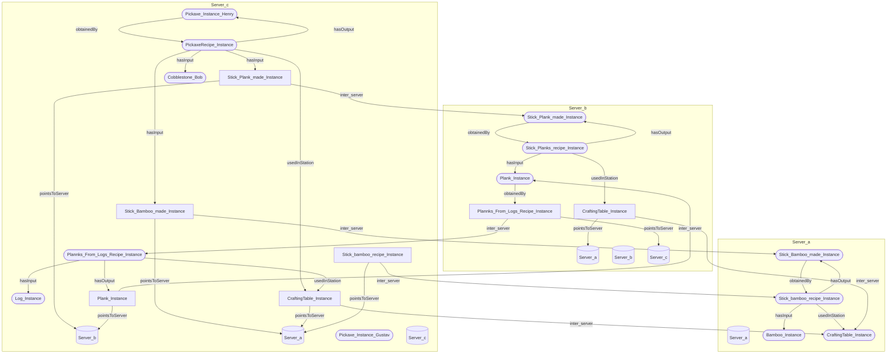

```mermaid
graph TD;
subgraph Server_a
Server_a_minecraft:Stick_Bamboo_made_Instance([Stick_Bamboo_made_Instance])
end
Server_a_minecraft:Stick_Bamboo_made_Instance-->|obtainedBy|Server_a_minecraft:Stick_bamboo_recipe_Instance

subgraph Server_a
Server_a_minecraft:Server_a[(Server_a)]
end

subgraph Server_a
Server_a_minecraft:Bamboo_Instance([Bamboo_Instance])
end

subgraph Server_a
Server_a_minecraft:CraftingTable_Instance([CraftingTable_Instance])
end

subgraph Server_a
Server_a_minecraft:Stick_bamboo_recipe_Instance([Stick_bamboo_recipe_Instance])
end
Server_a_minecraft:Stick_bamboo_recipe_Instance-->|hasInput|Server_a_minecraft:Bamboo_Instance
Server_a_minecraft:Stick_bamboo_recipe_Instance-->|hasOutput|Server_a_minecraft:Stick_Bamboo_made_Instance
Server_a_minecraft:Stick_bamboo_recipe_Instance-->|usedInStation|Server_a_minecraft:CraftingTable_Instance

subgraph Server_b
Server_b_minecraft:Stick_Plank_made_Instance([Stick_Plank_made_Instance])
end
Server_b_minecraft:Stick_Plank_made_Instance-->|obtainedBy|Server_b_minecraft:Stick_Planks_recipe_Instance

subgraph Server_b
Server_b_minecraft:Server_a[(Server_a)]
end

subgraph Server_b
Server_b_minecraft:Server_b[(Server_b)]
end

subgraph Server_b
Server_b_minecraft:Server_c[(Server_c)]
end

subgraph Server_b
Server_b_minecraft:Plank_Instance([Plank_Instance])
end
Server_b_minecraft:Plank_Instance-->|obtainedBy|Server_b_minecraft:Plannks_From_Logs_Recipe_Instance

subgraph Server_b
Server_b_minecraft:CraftingTable_Instance[CraftingTable_Instance]
end
Server_b_minecraft:CraftingTable_Instance-->|inter_server|Server_a_minecraft:CraftingTable_Instance
Server_b_minecraft:CraftingTable_Instance-->|pointsToServer|Server_b_minecraft:Server_a

subgraph Server_b
Server_b_minecraft:Stick_Planks_recipe_Instance([Stick_Planks_recipe_Instance])
end
Server_b_minecraft:Stick_Planks_recipe_Instance-->|hasInput|Server_b_minecraft:Plank_Instance
Server_b_minecraft:Stick_Planks_recipe_Instance-->|hasOutput|Server_b_minecraft:Stick_Plank_made_Instance
Server_b_minecraft:Stick_Planks_recipe_Instance-->|usedInStation|Server_b_minecraft:CraftingTable_Instance

subgraph Server_b
Server_b_minecraft:Plannks_From_Logs_Recipe_Instance[Plannks_From_Logs_Recipe_Instance]
end
Server_b_minecraft:Plannks_From_Logs_Recipe_Instance-->|inter_server|Server_c_minecraft:Plannks_From_Logs_Recipe_Instance
Server_b_minecraft:Plannks_From_Logs_Recipe_Instance-->|pointsToServer|Server_b_minecraft:Server_c

subgraph Server_c
Server_c_minecraft:Stick_Plank_made_Instance[Stick_Plank_made_Instance]
end
Server_c_minecraft:Stick_Plank_made_Instance-->|inter_server|Server_b_minecraft:Stick_Plank_made_Instance
Server_c_minecraft:Stick_Plank_made_Instance-->|pointsToServer|Server_c_minecraft:Server_b

subgraph Server_c
Server_c_minecraft:Stick_Bamboo_made_Instance[Stick_Bamboo_made_Instance]
end
Server_c_minecraft:Stick_Bamboo_made_Instance-->|inter_server|Server_a_minecraft:Stick_Bamboo_made_Instance
Server_c_minecraft:Stick_Bamboo_made_Instance-->|pointsToServer|Server_c_minecraft:Server_a

subgraph Server_c
Server_c_minecraft:Cobblestone_Bob([Cobblestone_Bob])
end

subgraph Server_c
Server_c_minecraft:Log_Instance([Log_Instance])
end

subgraph Server_c
Server_c_minecraft:Pickaxe_Instance_Henry([Pickaxe_Instance_Henry])
end
Server_c_minecraft:Pickaxe_Instance_Henry-->|obtainedBy|Server_c_minecraft:PickaxeRecipe_Instance

subgraph Server_c
Server_c_minecraft:Pickaxe_Instance_Gustav([Pickaxe_Instance_Gustav])
end

subgraph Server_c
Server_c_minecraft:Server_a[(Server_a)]
end

subgraph Server_c
Server_c_minecraft:Server_b[(Server_b)]
end

subgraph Server_c
Server_c_minecraft:Server_c[(Server_c)]
end

subgraph Server_c
Server_c_minecraft:Plank_Instance[Plank_Instance]
end
Server_c_minecraft:Plank_Instance-->|inter_server|Server_b_minecraft:Plank_Instance
Server_c_minecraft:Plank_Instance-->|pointsToServer|Server_c_minecraft:Server_b

subgraph Server_c
Server_c_minecraft:CraftingTable_Instance[CraftingTable_Instance]
end
Server_c_minecraft:CraftingTable_Instance-->|inter_server|Server_a_minecraft:CraftingTable_Instance
Server_c_minecraft:CraftingTable_Instance-->|pointsToServer|Server_c_minecraft:Server_a

subgraph Server_c
Server_c_minecraft:PickaxeRecipe_Instance([PickaxeRecipe_Instance])
end
Server_c_minecraft:PickaxeRecipe_Instance-->|hasInput|Server_c_minecraft:Stick_Plank_made_Instance
Server_c_minecraft:PickaxeRecipe_Instance-->|hasInput|Server_c_minecraft:Stick_Bamboo_made_Instance
Server_c_minecraft:PickaxeRecipe_Instance-->|hasInput|Server_c_minecraft:Cobblestone_Bob
Server_c_minecraft:PickaxeRecipe_Instance-->|hasOutput|Server_c_minecraft:Pickaxe_Instance_Henry
Server_c_minecraft:PickaxeRecipe_Instance-->|usedInStation|Server_c_minecraft:CraftingTable_Instance

subgraph Server_c
Server_c_minecraft:Stick_bamboo_recipe_Instance[Stick_bamboo_recipe_Instance]
end
Server_c_minecraft:Stick_bamboo_recipe_Instance-->|inter_server|Server_a_minecraft:Stick_bamboo_recipe_Instance
Server_c_minecraft:Stick_bamboo_recipe_Instance-->|pointsToServer|Server_c_minecraft:Server_a

subgraph Server_c
Server_c_minecraft:Plannks_From_Logs_Recipe_Instance([Plannks_From_Logs_Recipe_Instance])
end
Server_c_minecraft:Plannks_From_Logs_Recipe_Instance-->|hasInput|Server_c_minecraft:Log_Instance
Server_c_minecraft:Plannks_From_Logs_Recipe_Instance-->|hasOutput|Server_c_minecraft:Plank_Instance
Server_c_minecraft:Plannks_From_Logs_Recipe_Instance-->|usedInStation|Server_c_minecraft:CraftingTable_Instance
```
